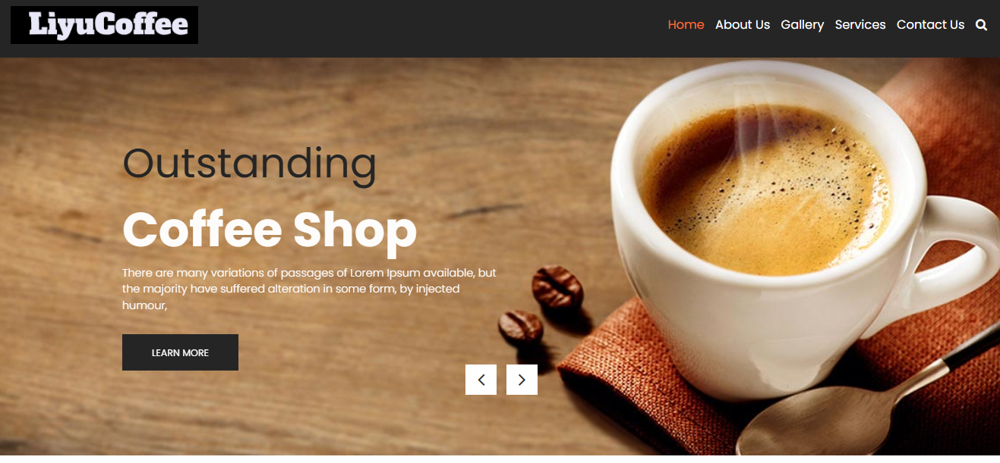
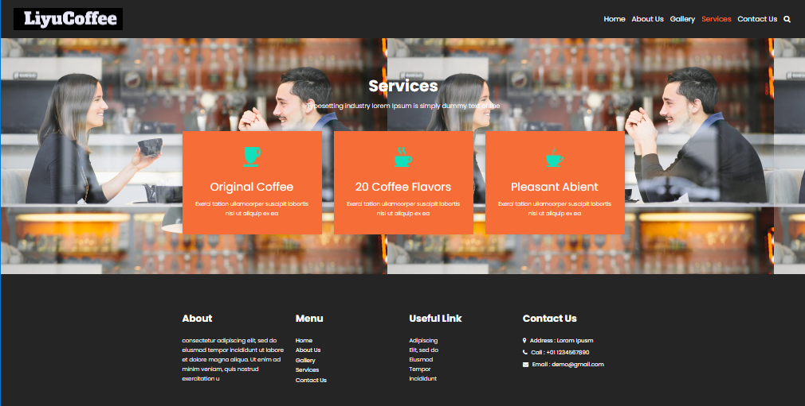

# LiyuCoffee Website

Welcome to the **LiyuCoffee** website repository! This project is a web platform for LiyuCoffee, showcasing its products, services, and company information. The website offers an easy-to-navigate interface for customers to explore the coffee products and learn more about the brand.
## Live Preview

Check out the live website here: [LiyuCoffee Website](https://liyu-coffee.vercel.app)

## Features

- **Home Page**: Engaging introduction with featured products and highlights.
- **Services Page**: Overview of the services offered by LiyuCoffee.
- **Product Gallery**: Display of different coffee products available for purchase.
- **Contact Form**: Contact section for customer inquiries.
- **Responsive Design**: Optimized for both desktop and mobile devices.

## Screenshots

### Logo


### Home Page


### Services Page


## Technologies Used

- **HTML5** and **CSS3** for structure and styling
- **JavaScript** for interactivity
- **Bootstrap** for responsive design

## Installation

To set up this project locally, follow these steps:

1. Clone the repository:
   ```bash
   git clone https://github.com/takee114/LiyuCoffee.git
